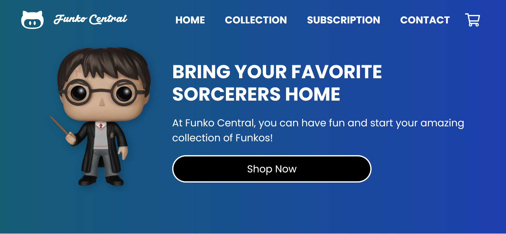

### **English**

# Funko Pop Shop - Funko Central



## Welcome! 👋

This project is an Integrative Work created with Tailwind CSS. However, it is currently the Minimum Viable Product (MVP) 🚀 and has been developed using Tailwind. In the future, it is anticipated to evolve towards React ⚛️ to further improve its functionality and performance. 🌟✨

This is an integrative practical work that follows the following slogans:

- It must contain at least three sections.
- To navigate between sections a menu will be used.
- It must adapt correctly to desktop screens, tablets and smartphones.
- The use of semantic tags is mandatory as appropriate.
- Include accessibility attributes according to ARIA recommendations.
- The architecture must be clean (folders and file names accordingly, internal organization of project resources)..

The Funko Central store was originally developed by Matías Paz. Seeks to provide a unique experience to fans and collectors of Funko figures around the world.

## Getting Started

To get started, clone this repository on your local machine:

```bash
git clone https://github.com/Matias-Paz/funko-central.git
```

Then, open the `public/index.html` file in your browser to view the page.

## Built with

- HTML
- CSS
- JavaScript
- Tailwind
- Postcss
- Autoprefixer

## Front-end Style Guide Layout

The designs were created to the following widths:

- Mobile: 375px
- Tablet: 768px
- Desktop: 1200px
- Desktop: 1440px

## Author

- LinkedIn - [Matías Paz](https://www.linkedin.com/in/matias-gabriel-paz/)

## Any suggestion

I would love for you to contribute to this project. If you have any ideas or suggestions, open a pull request or issue on GitHub. You can also contact me by [email](mailto:matiaspaz.dev@gmail.com).

----------------------------------------------------------------------------------------------------------------------------------------------------------------------------------------

### **Español**

# Tienda de Funko Pop - Funko Central

## ¡Bienvenido! 👋

Este proyecto es un Trabajo Integrador creado con Tailwind CSS. Sin embargo, actualmente es el Producto Mínimo Viable (MVP) 🚀 y se ha desarrollado utilizando Tailwind. En el futuro, se prevé que evolucione hacia React ⚛️ para mejorar aún más su funcionalidad y rendimiento. 🌟✨

Se trata de un trabajo práctico integrador que sigue las siguientes consignas:

- Debe contener, como mínimo, tres secciones.
- Para navegar entre secciones se utilizará un menú.
- Debe adaptarse correctamente a pantallas de escritorio, tablets y smartphones.
- Es obligatorio el uso de etiquetas semánticas según corresponda.
- Incluir atributos de accesibilidad según las recomendaciones ARIA.
- La arquitectura debe ser limpia (carpetas y nombres de archivos acordes, organización interna de los recursos del proyecto).

La tienda Funko Central fue originalmente desarrollada por Matías Paz. Busca brindar una experiencia única a los fanáticos y coleccionistas de figuras Funko en todo el mundo.

## Empezar

Para empezar, clone este repositorio en su máquina local:

```bash
git clone https://github.com/Matias-Paz/funko-central.git
```

Luego, abra el archivo `public/index.html` en su navegador para ver la página.

## **Tecnologías y metodologías utilizadas**

- HTML
- CSS
- JavaScript
- Tailwind
- Postcss
- Autoprefixer

## Diseño de la guía de estilo del front-end

Los diseños fueron creados con los siguientes anchos:

- Mobile: 375px
- Tablet: 768px
- Desktop: 1200px
- Desktop: 1440px

## Autor

- LinkedIn - [Matías Paz](https://www.linkedin.com/in/matias-gabriel-paz/)

## Cualquier sugerencia

Me encantaría que contribuyeras a este proyecto. Si tiene alguna idea o sugerencia, abre una pull request o issue en GitHub. También puedes ponerte en contacto conmigo por [email](mailto:matiaspaz.dev@gmail.com).
